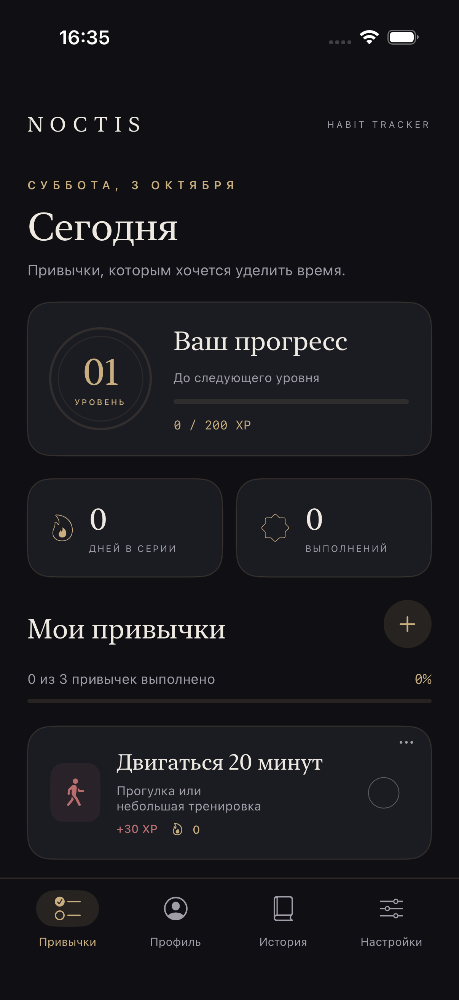
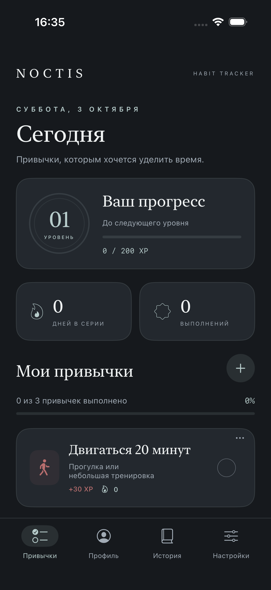
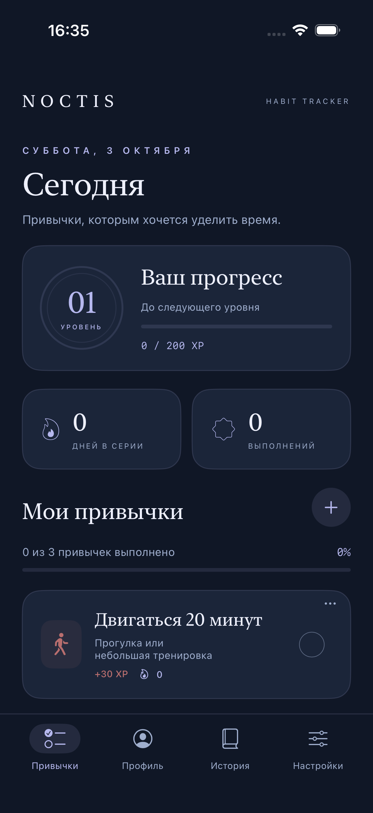
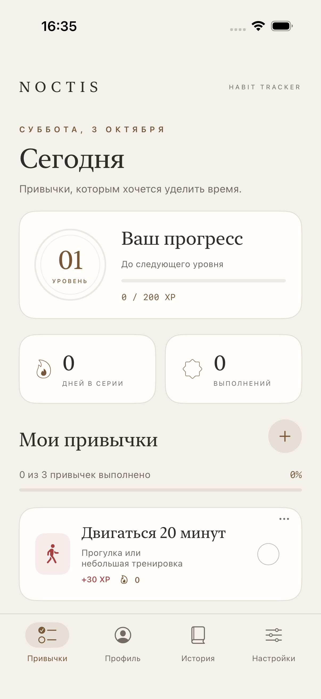
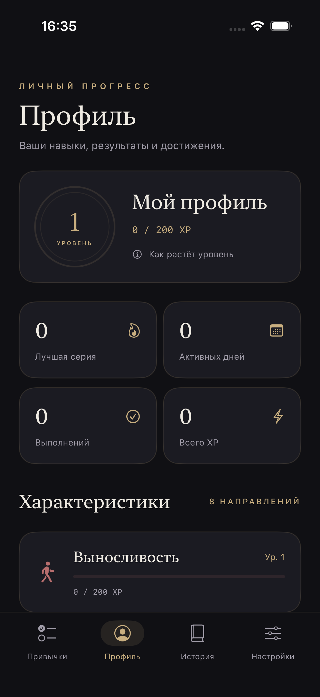
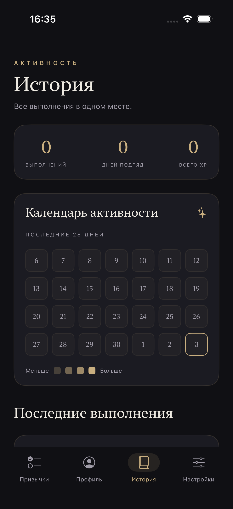
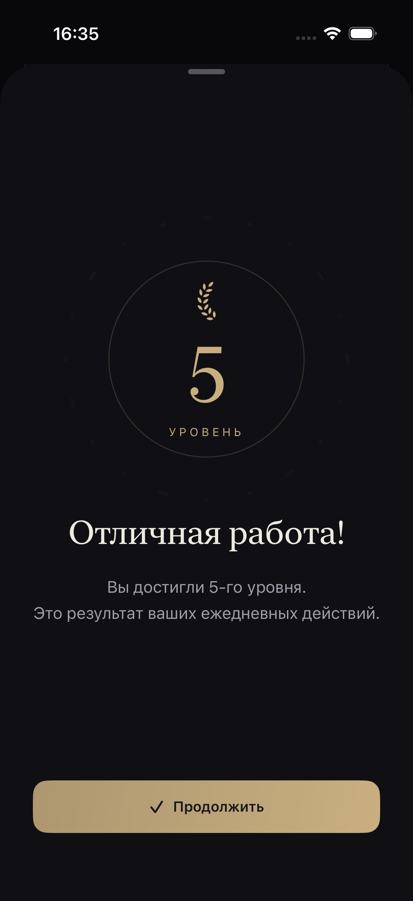
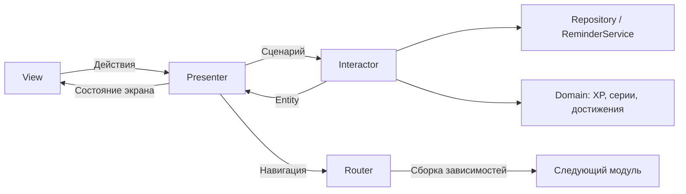

<div align="center">

# Noctis

**Привычки в вашем ритме.**

Трекер привычек для iPhone и iPad: спокойный интерфейс, развитие характеристик и понятный прогресс.

[](https://github.com/ddeeaaddllyy/GothicLounge/actions/workflows/ci.yml)


</div>

## Что внутри

- **Привычки:** создание, редактирование, ежедневные отметки, отмена выполнения, архив и восстановление.
- **Прогресс:** растущая стоимость уровней, отдельный опыт каждой характеристики и общая серия активных дней.
- **8 характеристик:** выносливость, знания, дисциплина, осознанность, концентрация, творчество, восстановление и общение.
- **24 достижения:** за выполнения, серии, уровни, разнообразие занятий и накопленный опыт. У каждого есть условие и индикатор прогресса.
- **Поздравления:** каждые пять общих уровней — отдельный экран с мягкой анимацией. Повторное выполнение после отмены не дублирует поздравление.
- **История:** календарь активности за 28 дней и список всех выполнений.
- **Напоминания:** ежедневные локальные уведомления с индивидуальным временем для каждой привычки.
- **Оформление:** четыре темы, плавные переходы и поддержка системного «Уменьшения движения».

Данные хранятся локально. Аккаунт, реклама и сторонние SDK не требуются. Три стартовые привычки помогают начать; история и XP изначально пустые.

## Темы

| Обсидиан | Графит | Полночь | Бумага |
|:---:|:---:|:---:|:---:|
| Чёрный и мягкое золото | Серый и серебро | Синий и лавандовый | Тёплая светлая палитра |
|  |  |  |  |

Тема выбирается в **Настройки → Тема оформления**, применяется сразу ко всем экранам и сохраняется после перезапуска. Готический характер остаётся в сдержанной типографике и деталях, а тексты интерфейса используют обычные названия действий.

## Профиль, история и поздравления

| Профиль | История | Юбилейный уровень |
|:---:|:---:|:---:|
|  |  |  |

## Запуск

**Нужно:** macOS, Xcode 26.3 и установленный iOS Simulator. Приложение поддерживает iOS 17.6+, iPhone и iPad. Внешних зависимостей нет.

```sh
git clone git@github.com:ddeeaaddllyy/GothicLounge.git
cd GothicLounge
open GothicLounge.xcodeproj
```

Выберите схему **GothicLounge**, симулятор и нажмите **⌘R**. Для запуска на физическом устройстве укажите свою команду Apple в **Signing & Capabilities**.

Сборка без подписи:

```sh
xcodebuild -project GothicLounge.xcodeproj -scheme GothicLounge \
  -configuration Debug -destination 'generic/platform=iOS Simulator' \
  CODE_SIGNING_ALLOWED=NO build
```

## Уровни и опыт

Награда за привычку — **10, 20, 30 или 50 XP**. Она начисляется один раз в календарный день и одновременно развивает выбранную характеристику и общий уровень. Повторное нажатие отменяет отметку и её награду.

Стоимость перехода с уровня `L` на следующий:

```text
XP следующего уровня = 200 + 75 × (L − 1)
Всего XP для уровня L = 200 × (L − 1) + 75 × (L − 1) × (L − 2) / 2
```

| Текущий уровень | Всего XP для его достижения | XP до следующего |
|---:|---:|---:|
| 1 | 0 | 200 |
| 2 | 200 | 275 |
| 3 | 475 | 350 |
| 5 | 1 250 | 500 |
| 10 | 4 500 | 875 |

Характеристики используют такую же шкалу. Юбилейные уровни — **5, 10, 15, 20…**. Показанное поздравление запоминается в сохранении и не появляется повторно после отмены отметки или перезапуска.

## Достижения и серии

| Категория | Условия |
|---|---|
| Выполнения | 1, 10, 50, 100, 250, 500 |
| Лучшая серия | 3, 7, 14, 30, 60, 100 дней |
| Общий уровень | 5, 10, 20, 30, 50 |
| Разные характеристики | Опыт в 2, 4 и 8 направлениях |
| Специализация | Любая характеристика достигла уровня 5 |
| Активные дни | 30 дней, не обязательно подряд |
| Общий опыт | 1 000 и 10 000 XP |

Общая серия требует хотя бы одной выполненной привычки в день. У каждой привычки также есть собственная серия. Незавершённый сегодняшний день не обрывает серию; пропуск полного дня обрывает. Достижения используют **лучшую историческую серию**, поэтому обычный пропуск не лишает полученного значка. Отмена выполнения пересчитывает достижения по фактической истории.

## Архитектура · VIPER

Каждый функциональный модуль содержит отдельные `View`, `Interactor`, `Presenter`, `Entity`, `Router` и `Contracts`.



- **View** рисует состояние и передаёт действия Presenter. Сохранения и бизнес-правила из View недоступны.
- **Interactor** выполняет сценарии, работает с репозиторием и уведомлениями, получает доменные снимки прогресса.
- **Presenter** форматирует данные, публикует состояние через `ObservableObject` и обращается к Router для переходов.
- **Entity** представляет доменные данные и состояние экрана. XP, серии, достижения и юбилейные уровни рассчитываются в `Core`.
- **Router** собирает модуль и управляет вкладками, редактором, деталями и поздравлением.

```text
GothicLounge/
├── Core/                 # Модели, прогресс, достижения, JSON-репозиторий, уведомления
├── DesignSystem/         # Палитры, компоненты, индикаторы и анимации
├── Modules/
│   ├── Shell/            # Сборка приложения, вкладки, передача темы
│   ├── Rituals/          # Привычки на сегодня и поздравление с уровнем
│   ├── Editor/           # Создание и редактирование привычки
│   ├── Character/        # Профиль, характеристики, достижения
│   ├── Chronicle/        # Календарь и история
│   └── Sanctuary/        # Темы, настройки, архив
└── Assets.xcassets/
Tests/                    # Доменная логика, миграция и сохранение
UITests/                  # Сквозные сценарии приложения
Scripts/                  # Выбор симулятора для CI, генератор иконки
.github/workflows/        # CI и подготовка GitHub Release
```

Внутренние имена модулей сохранены для преемственности; в интерфейсе используются «Привычки», «Профиль», «История» и «Настройки». Палитра передаётся через SwiftUI Environment, её выбор хранится через Interactor и Repository. Глобального изменяемого объекта темы нет.

## Проверки

26 модульных тестов проверяют доменную логику, миграцию и файловое сохранение на macOS. Три UI-сценария проверяют взаимодействие с приложением.

Запуск модульных тестов:

```sh
swift test
```

UI-тесты запускаются через **⌘U** в Xcode или командой:

```sh
xcodebuild -project GothicLounge.xcodeproj -scheme GothicLounge \
  -destination 'platform=iOS Simulator,name=iPhone 17 Pro,OS=26.2' \
  -parallel-testing-enabled NO CODE_SIGNING_ALLOWED=NO test
```

Замените устройство на установленное: `xcrun simctl list devices available`.

**Покрываемые сценарии:** границы уровней и рост стоимости XP, отмена награды, все характеристики, исторические серии, переход года и DST, достижения, миграция старого JSON, повреждение файла, отказ записи, темы после перезапуска и отсутствие повторных поздравлений. UI-тесты проверяют создание, выполнение, перезапуск, архивирование и восстановление привычки, четыре темы и юбилейный уровень. Тестовые данные изолированы от обычного сохранения; этот механизм отсутствует в Release.

## CI/CD · GitHub Actions

### CI

[ci.yml](.github/workflows/ci.yml) запускается на push в ветки, pull request и вручную. Использует macOS 15 и Xcode 26.3:

1. Выполняет `swift test --enable-code-coverage`.
2. Выбирает доступный iPhone Simulator и запускает UI-тесты.
3. Собирает приложение в конфигурации Release для симулятора.
4. Сохраняет логи, `.xcresult` со скриншотами и `Noctis-Simulator.zip` как артефакты на 14 дней.

### Подготовка релиза

[release.yml](.github/workflows/release.yml) запускается по тегу `v*`. Сначала повторно проходит полный CI, затем создаёт **черновик GitHub Release** с артефактом и автоматически собранными release notes.

```sh
git tag v1.1.0
git push origin v1.1.0
```

Откройте **GitHub → Releases**, проверьте черновик и опубликуйте его при готовности. Workflow использует штатный `GITHUB_TOKEN`: права записи выдаются только задаче создания релиза. Дополнительные секреты для этого процесса не нужны.

**Артефакт предназначен только для iOS Simulator.** Это не подписанный IPA. TestFlight/App Store не настроены: для них нужны Apple Developer Team, сертификат распространения, provisioning profile и доступ App Store Connect. Workflows начнут выполняться после отправки файлов в GitHub; локальная проверка не означает, что удалённый pipeline уже запускался.

Справка: [артефакты GitHub Actions](https://docs.github.com/en/actions/tutorials/store-and-share-data), [состав macOS runner](https://github.com/actions/runner-images/blob/main/images/macos/macos-15-arm64-Readme.md), [создание релизов через GitHub CLI](https://cli.github.com/manual/gh_release_create).

## Данные и ограничения

- Файл: `Application Support/GothicLounge/realm.json` в контейнере приложения. Запись атомарная; при ошибке записи состояние в памяти не меняется. Повреждённый файл не перезаписывается.
- Старые сохранения читаются автоматически: история, идентификаторы и XP сохраняются; уровни пересчитываются по новой шкале. Новые настройки получают значения по умолчанию.
- Изменение названия, награды или характеристики привычки не переписывает прошлые выполнения. Архивирование сохраняет историю и XP.
- Привычки повторяются ежедневно. Максимум — 50 активных привычек. Недельных расписаний, синхронизации между устройствами и экспорта пока нет.
- Напоминания следуют местному времени и повторяются ежедневно, даже если привычка уже выполнена. Разрешение iOS запрашивается при включении напоминания. Доставка зависит от разрешений, Focus и настроек устройства.
- Удаление приложения удаляет локальные данные. Перед экспериментами с форматом сохранения сделайте резервную копию контейнера.

## Разработка

Используйте четыре пробела, UpperCamelCase для типов и lowerCamelCase для свойств и методов. Новые бизнес-правила помещайте в доменный слой и покрывайте тестами; зависимости передавайте через контракты VIPER. UI-изменения проверяйте как минимум в тёмной и светлой темах, с Reduce Motion и на разных размерах экрана.

Иконка создаётся собственным векторным генератором: `swift Scripts/GenerateIcon.swift`. Исходный прежний ассет сохранён отдельно в `docs/legacy-assets/` и не попадает в приложение.
